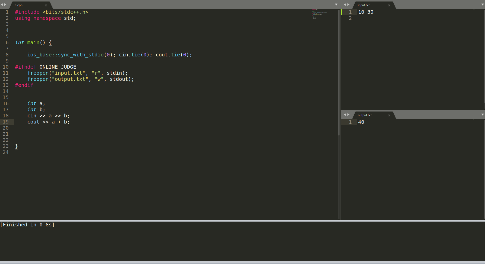

# Competitive Programming Template :trophy:

This is a simple template that I use to write my solutions on websites like codeforces or atcoder. You have to write on input.txt the problem's input that the website gives you. Run the file and the output will be written in output.txt so you can check out the solution in a fast way.

My setup:




Here we include the whole std library so we don't have to include vectors, sets etc etc... 
I don't like to use "using namespace std" but for competitive programming is the way to go.

```c++
#include <bits/stdc++.h>
using namespace std;
```
standard C++ streams are synchronized with the C standard I/O streams so it can slow down output and input with std::cout and std::cin, so this synchronization can can be disabled with this line of code

```c++
ios_base::sync_with_stdio(0); cin.tie(0); cout.tie(0);
```
By default the ONLINE_JUDGE constant is defined when submitting any code in most online judges like Codechef and Codeforces, So I can use a txt for the problem's input and output in my local machine and it will not affect when submitting a solution to a website. 


```c++
#ifndef ONLINE_JUDGE
	freopen("input.txt", "r", stdin);
	freopen("output.txt", "w", stdout);
#endif
```
